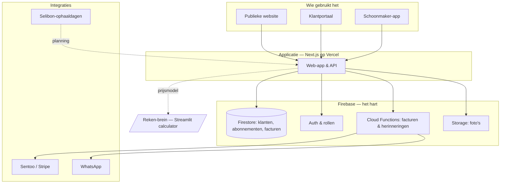
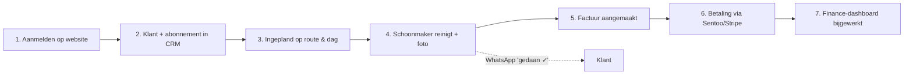
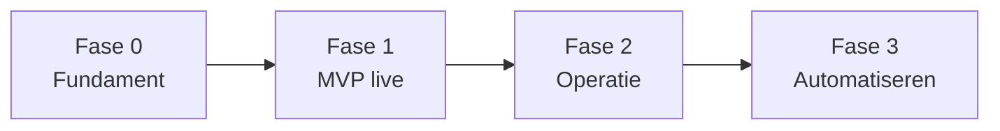

# Kliko Cleaning Bonaire — Roadmap & Systeem-blauwdruk

> Van rekentool naar volledig bedrijfssysteem: één plek om de website, klanten,
> abonnementen, planning, facturen en cijfers te beheren — mobiel-eerst, in dollars,
> gebouwd voor Bonaire.
>
> Opgesteld 4 juli 2026 · Steffie & Roderick · v1

De interactieve, afvinkbare versie van deze roadmap staat als losse pagina (Claude
artifact). Dit bestand is de vaste kopie die bij het project blijft.

---

## 1. De aanpak — twee breinen, niet één alleskunner

De huidige Streamlit-app is een uitstekend **reken- en verkoop-brein** (scenario's,
break-even, prijsbeleid, marktonderzoek, offertes). Die houden we zoals hij is.

Een publieke website mét klantportaal, terugkerende facturen en een schoonmaker-app op
de telefoon vraagt om de **bewezen Bonaire-stack** — dezelfde als Dede Transport en
Duly Bonaire.

| | Reken-brein (blijft, intern) | Operatie-brein (nieuw, live) |
|---|---|---|
| **Wat** | Scenario's, break-even, prijsbeleid, offertes | Website, CRM, abonnementen, planning, facturen |
| **Voor wie** | Alleen jij, als planningsgereedschap | Klanten + team, dagelijks gebruik |
| **Stack** | Python · Streamlit | Next.js · Firebase · Vercel · Sentoo/Stripe |

**Aanbeveling:** bouw het operationele systeem op Next.js + Firebase en hergebruik het
prijsmodel dat al in de calculator zit (2 klanttypes × 3 frequenties, kosten per
reiniging, capaciteit).

---

## 2. Systeem-architectuur

## 3. De klantreis — van aanmelden tot betaald

---

## 4. De 9 bouwstenen

| # | Module | Kern |
|---|---|---|
| 01 | **Publieke website & aanmelden** | Landing, tarieven, servicegebied, online aanmelden → direct klant, offerte voor bedrijven |
| 02 | **Klanten (CRM)** | Klantkaart, GPS-pin, kliko's + type, historie, tags, zoeken/filteren op wijk |
| 03 | **Abonnementen** | Type × frequentie, prijs, status (actief/pauze/gestopt), MRR, pauzeren/opzeggen |
| 04 | **Planning & route** | Weekplanning per dag/wijk, afgestemd op Selibon, capaciteitscheck, kaart, herplannen |
| 05 | **Schoonmaker-app (mobiel)** | Vandaag-lijst, afvinken + foto-bewijs, overslaan met reden, navigatie |
| 06 | **Facturen & betalingen** | Maandfacturen, betaallink, status, herinneringen, ABB, boekhoud-export |
| 07 | **Finance & rapportage** | Omzet/kosten/winst, MRR, churn, kosten invoeren, werkelijk vs. prognose |
| 08 | **Communicatie & automatisering** | WhatsApp-first: bevestiging, "wij komen morgen", "gedaan ✓", factuur, herinnering |
| 09 | **Beheer & rollen** | Rollen (eigenaar/kantoor/schoonmaker), dashboard, prijsbeleid, klantportaal, meertalig |

---

## 5. Roadmap in 4 fases

### Fase 0 — Fundament (zonder code)
- [ ] Stack bevestigen: Next.js + Firebase + Vercel
- [ ] Firebase-project aanmaken (Blaze plan)
- [ ] Domeinnaam kiezen & registreren (bv. klikocleaning.com)
- [ ] Betaalprovider kiezen: Sentoo of Stripe
- [ ] KvK Bonaire + ABB-registratie regelen
- [ ] Huisstijl: logo, kleuren, foto's (kliko voor/na)
- [ ] Prijsmodel uit de calculator overzetten als config

### Fase 1 — MVP: eerste klanten online
- [ ] Landingspagina met uitleg + tarieven
- [ ] Aanmeldformulier → klant + abonnement in Firestore
- [ ] CRM-overzicht: klantenlijst + klantkaart
- [ ] Login + rollen (eigenaar / kantoor)
- [ ] Bevestigingsmail/WhatsApp bij aanmelden
- [ ] Eerste facturen (nog handmatig aanmaken mag)
- [ ] Deploy naar Vercel + domein live

### Fase 2 — Operatie: de dagelijkse gang
- [ ] Weekplanning: kliko's per dag en per wijk
- [ ] Schoonmaker-app: vandaag-lijst op telefoon
- [ ] Afvinken "gedaan" + foto-bewijs
- [ ] Route afstemmen op Selibon-ophaaldagen
- [ ] "Wij komen morgen" + "gedaan ✓" naar klant
- [ ] Capaciteits-check waarschuwt bij overboeking

### Fase 3 — Automatiseren & schalen
- [ ] Automatische maandfacturen + betaallink
- [ ] Betaalstatus + automatische herinneringen
- [ ] Finance-dashboard: omzet, kosten, winst, MRR, churn
- [ ] Klantportaal: eigen facturen + volgende beurt + wijzigen
- [ ] WhatsApp-automatisering volledig ingericht
- [ ] Meertalig NL / Papiaments / Engels
- [ ] Firestore security rules + Google Business profiel

---

## 6. Waar Bonaire het net anders maakt

- **Alles in dollars** — Bonaire rekent in USD, niet in euro's. Prijzen, facturen én het
  finance-dashboard in `$`. (De calculator rekent nu nog in `€` — ook omzetten.)
- **ABB, geen BTW** — Bonaire heeft de algemene bestedingsbelasting. Facturen en
  boekhoud-export daarop inrichten.
- **Selibon-ophaaldagen** — plan het schoonmaken rond de ophaaldagen per wijk: lege kliko
  = beter resultaat + efficiëntere route.
- **WhatsApp is het kanaal** — bijna alle klantcontact loopt via WhatsApp. Bevestigingen,
  herinneringen en foto's daaromheen bouwen, niet e-mail-first.
- **Water hergebruiken** — schaars en duur op het eiland. Een hergebruik-systeem is zowel
  een kostenpost in het model als een sterk verkoopargument (milieuvriendelijk).
- **Marketing = de community** — Facebook-groepen en mond-tot-mond werken sterker dan
  advertenties. Deelbare voor/na-foto's helpen.

---

## 7. Zes keuzes die de bouw bepalen

Zodra deze beslist zijn, kan Fase 0 starten.

1. **Stack akkoord?** Next.js + Firebase (advies), of toch binnen Streamlit proberen?
2. **Betaalprovider?** Sentoo, Stripe, bankoverschrijving, contant — wat werkt op Bonaire?
   *Advies: Sentoo als het werkt, anders Stripe + contant/bank als vangnet.*
3. **Valuta** — bevestigen: alles in USD? *Advies: ja, USD.*
4. **Domeinnaam** — klikocleaning.com, kliko-bonaire.com, of anders?
5. **Rollen & team** — wie doet wat, en hoeveel schoonmakers krijgen de app?
   *Advies: start met 3 rollen — eigenaar, kantoor, schoonmaker.*
6. **Talen** — alleen NL starten, of meteen Papiaments + Engels erbij?
   *Advies: NL eerst live, Papiaments + EN in Fase 3.*
